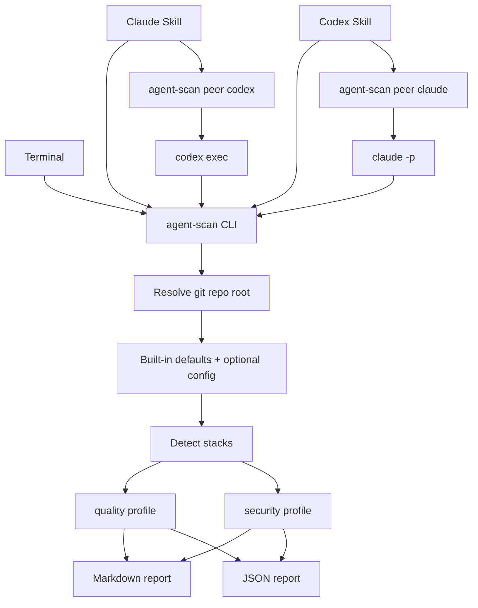

# agent-scan-plan.md

## Summary

Build `agent-scan`, a generic on-demand pre-commit scanner usable from terminal, Claude Code, and Codex. The scanner is the stable core; Claude Skills and Codex Skills are thin wrappers around it.

This works both directions:

- Claude can ask Codex to audit via `agent-scan peer codex`.
- Codex can ask Claude to audit via `agent-scan peer claude`.
- Peer audits use fresh non-interactive subprocesses in the same repo.
- Peer audits are read-only and cannot recursively call the other model.

Default behavior:

- Run from any directory inside a git repo.
- Resolve the git repo root automatically.
- Default scope is `worktree`: staged, unstaged, and untracked files.
- Markdown is the human-readable output.
- JSON is the machine-readable output.
- Repos work with built-in defaults; `.agent-scan.json` is optional.

## Architecture



## CLI Interface

Implement a Go CLI installed as `~/.local/bin/agent-scan`. Built from
`./cmd/agent-scan` with `go build`. Stdlib only — no third-party runtime
dependencies (JSON config keeps `encoding/json` sufficient; no TOML library
needed).

Commands:

```bash
agent-scan quality [--scope SCOPE] [--json] [--out-dir DIR] [--timeout SECONDS]
agent-scan security [--scope SCOPE] [--json] [--out-dir DIR] [--timeout SECONDS]
agent-scan peer codex [quality|security] [--scope SCOPE]
agent-scan peer claude [quality|security] [--scope SCOPE]
agent-scan version
```

Default examples:

```bash
agent-scan quality
agent-scan security
agent-scan security --json
agent-scan peer codex security
agent-scan peer claude quality --scope staged
```

Scopes:

```text
staged      index only
unstaged    modified tracked files not staged
untracked   untracked files only
worktree    staged + unstaged + untracked; default
all         whole repo
```

Important v1 rule:

```text
Scope controls file inventory and built-in file checks.
Some ecosystem commands run against the current working tree because tools like test runners,
linters, package audits, and compilers usually do not operate directly against the git index.
For normal pre-commit confidence, use the default `worktree` scope.
```

Exit codes:

```text
0  pass or warning
1  blocking findings or failed checks
2  scanner/runtime error such as bad args or no git repo
3  peer recursion blocked
```

Default timeouts:

```text
quality   300 seconds
security  600 seconds
peer      900 seconds
```

## Config And Output

Config is optional.

Precedence:

```text
built-in defaults < ~/.config/agent-scan/config.json < <repo>/.agent-scan.json < CLI flags
```

Use JSON so the CLI can parse config with `encoding/json` from the Go stdlib.
Unknown fields are rejected (`json.Decoder.DisallowUnknownFields`) so typos
fail loudly instead of silently being ignored.

Example `.agent-scan.json`:

```json
{
  "version": 1,
  "default_scope": "worktree",
  "policy": {
    "missing_tools": "skip",
    "fail_on": ["critical", "high", "command_failed"]
  },
  "timeouts": {
    "quality": 300,
    "security": 600,
    "peer": 900
  },
  "ignore": {
    "paths": ["vendor/**", "node_modules/**", "dist/**", "coverage/**"]
  },
  "quality": {
    "extra_commands": []
  },
  "security": {
    "extra_commands": [],
    "disabled_tools": []
  }
}
```

Output rules:

- Default stdout is Markdown.
- `--json` writes JSON to stdout.
- `--out-dir DIR` writes both `report.md` and `report.json`.
- Machine readers must parse JSON, not Markdown.

JSON v1 shape:

```json
{
  "tool": "agent-scan",
  "version": 1,
  "repo_root": "/abs/path",
  "profile": "quality",
  "scope": "worktree",
  "result": "pass|warning|fail|error",
  "changed_files": [],
  "checks": [],
  "findings": [],
  "skipped": []
}
```

Finding shape:

```json
{
  "severity": "info|low|medium|high|critical",
  "file": "path/to/file.go",
  "line": 42,
  "tool": "gosec",
  "rule": "G101",
  "message": "Finding text",
  "remediation": "Suggested fix"
}
```

## Scan Profiles

Missing tools are reported as `SKIPPED` unless config changes `policy.missing_tools`.

Quality profile:

```text
generic:
  git diff --check
  changed-file inventory
  large/binary/generated-file warnings

go:
  gofmt -l on changed .go files
  go test ./...
  golangci-lint run if installed, otherwise go vet ./...

node:
  detect package manager from lockfile
  run configured package scripts: lint, typecheck, test

python:
  ruff check if installed/configured
  pytest if installed/configured
  mypy or pyright if installed/configured

rust:
  cargo fmt --check
  cargo clippy if available
  cargo test
```

Security profile:

```text
generic:
  built-in secret regex scan on changed text files
  gitleaks if installed
  trivy fs . if installed

go:
  govulncheck ./... if installed
  gosec ./... if installed

node:
  package-manager audit when available
  osv-scanner if installed

python:
  pip-audit if installed
  bandit if installed

rust:
  cargo audit if installed
```

Stack detection:

```text
go.mod                 Go
package.json           Node
pyproject.toml         Python
requirements*.txt      Python
Cargo.toml             Rust
Dockerfile/compose/k8s Docker/IaC-related generic security checks
```

Multiple stacks run all applicable checks.

## Peer Audit Behavior

Peer calls are implemented inside `agent-scan`, not separately in each agent prompt.

Recursion guard:

```text
If AGENT_SCAN_PEER_DEPTH is set, refuse peer dispatch and exit 3.
Otherwise set AGENT_SCAN_PEER_DEPTH=1 in the child process environment.
```

Claude to Codex:

```bash
agent-scan peer codex security --scope worktree
```

Draft child invocation:

```bash
codex exec -C <repo-root> --sandbox read-only --ask-for-approval never --ephemeral "<peer prompt>"
```

Codex to Claude:

```bash
agent-scan peer claude security --scope worktree
```

Draft child invocation:

```bash
claude -p --no-session-persistence --allowedTools "Bash(agent-scan:*),Read,Grep,Glob" "<peer prompt>"
```

Step 0 must verify the final installed CLI flag syntax with:

```bash
codex exec --help
claude --help
```

Peer prompt requirements:

```text
Read-only audit only.
Do not edit files.
Do not stage, commit, stash, checkout, reset, merge, rebase, or push.
May run agent-scan and inspect files.
Do not call agent-scan peer or invoke the other model.
Return findings as severity, file:line, and description.
```

## Claude Skill And Codex Skill Integration

Claude Skill package:

- Install personal Claude Skill command files under `~/.claude/commands/`.
- These are cross-repo reusable Markdown command files.
- Command names come from filenames.
- Use `$ARGUMENTS`, `$1`, `$2`, etc.; do not use shell-only forms like `${@:2}` inside command Markdown.

Claude Skill files:

```text
~/.claude/commands/scan-quality.md
~/.claude/commands/scan-security.md
~/.claude/commands/codex-audit.md
```

`scan-quality.md`:

```md
---
allowed-tools: Bash(agent-scan:*)
argument-hint: "[--scope SCOPE] [--json]"
description: Run agent-scan quality on the current repo
---

> Example: `/scan-quality --scope staged --json`

Run `agent-scan quality $ARGUMENTS`.

Surface findings grouped by severity. Do not edit files. Do not stage, commit,
stash, checkout, reset, merge, rebase, or push.
```

`scan-security.md`:

```md
---
allowed-tools: Bash(agent-scan:*)
argument-hint: "[--scope SCOPE] [--json]"
description: Run agent-scan security on the current repo
---

> Example: `/scan-security --scope worktree`

Run `agent-scan security $ARGUMENTS`.

Lead with high and critical findings. Do not edit files. Do not stage, commit,
stash, checkout, reset, merge, rebase, or push.
```

`codex-audit.md`:

```md
---
allowed-tools: Bash(agent-scan:*)
argument-hint: "[quality|security] [--scope SCOPE]"
description: Ask Codex to audit the current repo changes
---

> Example: `/codex-audit security`

If `$1` is empty, run `agent-scan peer codex security --scope worktree`.
If `$1` is `quality` or `security`, run `agent-scan peer codex $ARGUMENTS`.

Do not use shell argument expansion such as `${@:2}`. Let `agent-scan` validate
arguments and defaults.

Surface the result as a labeled "Codex audit" section. Do not edit files.
```

Codex Skill package:

```text
~/.codex/skills/agent-scan-audit/SKILL.md
```

`SKILL.md`:

```md
---
name: agent-scan-audit
description: Run agent-scan for generic pre-commit quality and security scans, or ask Claude for a read-only peer audit. Use when the user asks to scan changes, audit changes, run a pre-commit scan, run a quality scan, run a security audit, or ask Claude for a second opinion.
---

> Example: "scan my changes" → `agent-scan quality --scope worktree`
> Example: "ask Claude to audit" → `agent-scan peer claude security --scope worktree`

When the user asks to scan current changes:

- Quality scan: run `agent-scan quality --scope worktree`.
- Security scan: run `agent-scan security --scope worktree`.
- Claude peer audit: run `agent-scan peer claude security --scope worktree` unless the user requests `quality`.

Surface findings grouped by severity. Do not edit files unless the user separately asks
for fixes after reviewing the scan. Do not stage, commit, stash, checkout, reset,
merge, rebase, or push.
```

## Repo Layout

Create a new repo named `agent-scan`.

```text
agent-scan/
├── README.md
├── go.mod
├── docs/
│   ├── agent-scan-plan.md
│   └── todo/
├── cmd/
│   └── agent-scan/
│       └── main.go
├── internal/
│   ├── cli/
│   │   ├── cli.go
│   │   └── cli_test.go
│   ├── config/
│   │   ├── config.go
│   │   └── config_test.go
│   ├── scope/
│   │   ├── scope.go
│   │   └── scope_test.go
│   ├── stacks/
│   │   ├── stacks.go
│   │   └── stacks_test.go
│   ├── peer/
│   │   ├── peer.go
│   │   └── peer_test.go
│   ├── report/
│   │   ├── report.go
│   │   └── report_test.go
│   ├── secrets/
│   │   ├── secrets.go
│   │   └── secrets_test.go
│   └── profiles/
│       ├── quality.go
│       ├── quality_test.go
│       ├── security.go
│       └── security_test.go
├── templates/
│   ├── claude-skills/
│   │   ├── scan-quality.md
│   │   ├── scan-security.md
│   │   └── codex-audit.md
│   └── codex-skills/
│       └── agent-scan-audit/
│           └── SKILL.md
├── install.sh
└── uninstall.sh
```

Tests live next to the source they cover (Go convention: `foo_test.go` next
to `foo.go`).

`install.sh` behavior:

```text
Require Go 1.22+ on PATH; exit with a clear error if missing.
Build with `go build -trimpath -o ~/.local/bin/agent-scan ./cmd/agent-scan`.
Copy Claude Skill command files to ~/.claude/commands/.
Copy Codex Skill to ~/.codex/skills/agent-scan-audit/.
Back up existing files to *.bak.
Refuse to overwrite an existing *.bak.
Be idempotent.
```

`uninstall.sh` behavior:

```text
Remove installed CLI and templates.
Restore *.bak files if present.
Do not delete user-created config files.
```

## Build Sequence

All implementation is TDD: red → green → refactor. Write the failing test
first, watch it fail with the expected error, write the minimum code to pass,
then refactor with tests green. No production code without a failing test
first. This rule applies to every step below.

1. Verify CLI flags and extension paths:
   - `claude --help`
   - `codex exec --help`
   - Confirm `~/.claude/commands/` behavior.
   - Confirm `~/.codex/skills/<name>/SKILL.md` behavior.

2. Scaffold repo:
   - `go mod init` (module path: e.g. `github.com/<user>/agent-scan`).
   - `cmd/agent-scan/main.go` with a stub `version` subcommand.
   - No third-party runtime dependencies.
   - Plan already lives at `docs/agent-scan-plan.md`.

3. Implement scope resolution with tests:
   - staged, unstaged, untracked, worktree, all.
   - Works from subdirectories.
   - Clean repo returns empty changes, not error.

4. Implement config loading with tests:
   - built-in defaults.
   - global config (`~/.config/agent-scan/config.json`).
   - repo config (`<repo>/.agent-scan.json`).
   - CLI flag overrides.
   - Unknown fields rejected.

5. Implement report model and renderers with tests:
   - stable JSON v1.
   - Markdown output.
   - exit-code mapping.

6. Implement quality profile with tests:
   - generic checks.
   - stack detection.
   - missing tools skipped.
   - command failures become findings.

7. Implement security profile with tests:
   - built-in fake-secret detection.
   - optional external tools skipped when unavailable.
   - findings normalized.

8. Implement peer dispatcher with tests:
   - Claude and Codex command construction.
   - recursion guard.
   - child env includes `AGENT_SCAN_PEER_DEPTH=1`.
   - output streamed or captured predictably.

9. Add Claude Skill and Codex Skill templates:
   - Ensure Claude command files avoid unsupported shell argument expansion.
   - Ensure both wrappers remain thin and defer defaults to the CLI.

10. Add installer and uninstaller:
    - Build CLI, install Claude Skill files, install Codex Skill files.
    - Verify idempotence and backup behavior.

11. End-to-end verify:
    - Terminal: `agent-scan quality`.
    - Terminal: `agent-scan security --json`.
    - Claude: `/scan-quality`.
    - Claude: `/codex-audit security`.
    - Codex: use `agent-scan-audit` locally.
    - Codex: ask Claude through `agent-scan peer claude security`.
    - Recursion blocked with `AGENT_SCAN_PEER_DEPTH=1`.

## Development Commands

Once `go.mod` exists:

```bash
go build ./...                                  # compile everything
go build -o ./agent-scan ./cmd/agent-scan       # local binary at repo root
go test ./...                                   # full test suite
go test ./internal/peer -run TestPeerRecursion  # single test
go test -cover ./...                            # coverage summary
go test -coverprofile=coverage.out ./... && go tool cover -func=coverage.out
gofmt -l .                                      # formatting drift
go vet ./...                                    # built-in static analysis
golangci-lint run                               # lint (revive, govet, staticcheck, errcheck, etc.)
./install.sh                                    # install CLI + skills (idempotent, backs up to *.bak)
./uninstall.sh                                  # remove and restore *.bak
```

`golangci-lint` is a developer dependency, not a runtime dependency — it's
installed locally per machine, not vendored into the module.

## Test Plan

Use temporary fixture repos via `t.TempDir()`. Spin up real `git init` repos
in tests where scope resolution needs verification — do not mock `git`.

Required tests:

```text
No config uses built-in defaults.
Global config applies.
Repo config overrides global config.
CLI flags override config.
Unknown config fields are rejected with a useful error.
All scopes include exactly the expected files.
Untracked files are scanned by default through worktree scope.
Markdown renders readable sections.
JSON is valid and stable.
Missing tools produce skipped checks.
Failed commands produce blocking findings.
Go/Node/Python/Rust stack detection works.
Built-in secret scan catches fake secrets.
Peer calls build correct subprocess commands.
Peer recursion exits 3.
Subdirectory execution resolves repo root.
Clean repo exits 0 with no changes.
install.sh is idempotent: re-running does not double-stomp existing files.
install.sh backs up existing files to *.bak before replacing.
install.sh refuses to overwrite an existing *.bak.
uninstall.sh restores *.bak files when present.
uninstall.sh leaves user-created config files in place.
Peer subprocess assembly verified end-to-end with fake claude/codex binaries on PATH (integration test, not just mocks).
```

Coverage target:

```text
80% line coverage on internal/ packages and cmd/agent-scan. CI fails below threshold.
Shell installers (install.sh, uninstall.sh) tested via bats or shell-based fixtures, not coverage-counted.
```

Acceptance criteria:

```text
agent-scan works from any git repo with no config file.
agent-scan quality defaults to worktree scope.
agent-scan security --json is machine-readable.
Claude can run local scans through Claude Skill commands.
Claude can ask Codex for a peer audit.
Codex can run local scans through a Codex Skill.
Codex can ask Claude for a peer audit.
No scan command mutates git state or edits repo files.
```

## Coding Standards

The "no eyebrow-raisers" rule applies: pick what an experienced Go engineer
would already reach for. When in doubt, follow Effective Go and the Go Code
Review Comments wiki. Each step file in `docs/todo/` references this section
rather than restating it.

- **Layout** — `cmd/agent-scan/` is the entrypoint; everything else under
  `internal/`. No top-level `pkg/`. No vanity wrapper packages.
- **Package names** — short, lowercase, no underscores or camelCase
  (`scope`, not `scope_resolver` or `scopeUtils`).
- **Errors** — sentinel `var ErrXxx = errors.New(...)` for known cases;
  `fmt.Errorf("…: %w", err)` for wrapping. Callers use `errors.Is` /
  `errors.As`. Library code never `panic`s; `cmd/` may panic only on
  programmer error during startup.
- **Context** — every function that does I/O, spawns subprocesses, or shells
  to git takes `ctx context.Context` as its first argument. Use
  `exec.CommandContext`, not `exec.Command`.
- **Subprocess** — a single `internal/run.Exec` helper owns process spawning,
  env scrubbing, and timeout enforcement. Profiles call it; they don't reach
  for `os/exec` directly.
- **JSON** — struct tags on every field used in I/O. Configure
  `json.Decoder.DisallowUnknownFields()` for config parsing. Disable HTML
  escaping when emitting reports.
- **Tests** — `t.TempDir`, `t.Setenv`, `t.Helper`; table-driven with `t.Run`
  subtests. Real `git init` repos for git-touching tests — not mocks. Real
  fake binaries on `PATH` for subprocess tests. CI runs with `-race`.
- **Formatting** — `gofmt` + `go vet` clean before every commit. CI fails on
  drift.
- **Lint** — `golangci-lint run` with at minimum `gofmt`, `govet`,
  `staticcheck`, `errcheck`, `revive` (with `exported` +
  `package-comments`), `gocyclo` (threshold 15), `unused`.
- **Receivers** — short consistent name; the same type uses the same
  receiver name and the same pointer-vs-value choice across all its methods.
- **No globals** — no package-level mutable state. Inject dependencies
  through constructors or function arguments.
- **Concurrency** — prefer simple sequential code. If parallelism is needed
  for independent checks, use `sync.WaitGroup` plus a buffered error channel;
  `golang.org/x/sync/errgroup` is *not* a runtime dependency we're taking
  in v1.
- **TDD** — applies to every step in the build sequence. Write the failing
  test, watch it fail with the expected error, write the minimum code, then
  refactor with tests green. No production code without a failing test
  first. Documentation and code comments must be present before a step is
  considered complete.

## Documentation Standards

Senior-dev quality. Apply throughout, not at the end. Not documented = not
done.

### Doc comments

Every exported identifier (package, type, function, method, constant,
variable) in `cmd/agent-scan/` and `internal/` carries a Go doc comment.
Follow the standard convention: the comment starts with the identifier name
and reads as a complete sentence.

- Package comment: one paragraph at the top of one file in each package
  (conventionally `doc.go` or the file matching the package name) describing
  the package's purpose.
- Function/method/type comment: purpose, behavior, returned errors, any
  non-obvious behavior. Keep them tight — Go doc comments are sentences,
  not essays.
- Unexported helpers (lowercase names) need a comment only when the name is
  not self-explanatory.
- CI runs `golangci-lint` with `revive`'s `exported` rule (and optionally
  `package-comments`) so missing comments on exported identifiers break the
  build. `gofmt` and `go vet` are non-negotiable.

### Inline comments

Comments are for the non-obvious WHY: constraints, invariants, workarounds,
behavior that would surprise a reader. Never restate WHAT — well-named
identifiers do that.

Skip:

- Block comments above obvious code.
- Multi-paragraph essays.
- References to the current task ("added for issue #X") — those belong in
  commit messages, not the source.

Keep:

- One-line context above tricky regex, subprocess flag choices, or git
  plumbing.
- Hidden constraints not visible from the call site.
- Why a value is what it is when a future reader would otherwise change it.

### README

`README.md` is the front door. Required sections, in this order:

1. **What it is** — one paragraph.
2. **Why** — one paragraph; lead with the dual-agent peer-audit angle.
3. **Install** — CLI install, Claude Skill install, Codex Skill install;
   one block per target. Show exact commands.
4. **Usage** — one example each: `agent-scan quality`,
   `agent-scan security`, `--scope staged`, `--json`, `peer codex`,
   `peer claude`. Show real abbreviated output for each.
5. **Integration** — how `/scan-quality`, `/scan-security`, `/codex-audit`
   work in Claude Code; how the Codex skill is invoked.
6. **Configuration** — link to the example `.agent-scan.json` with every
   field explained.
7. **Exit codes** — table.
8. **Troubleshooting** — at minimum: tool not found, peer recursion
   blocked, no git repo, scope returns no files, peer subprocess timed
   out.
9. **Contributing pointer** — even if it's just "open an issue."

Keep it scannable. No marketing copy. No emoji unless a teammate adds one.

### Template comment headers

Each Claude Skill command file (`scan-quality.md`, `scan-security.md`,
`codex-audit.md`) and the Codex `SKILL.md` opens its body (after frontmatter)
with a single-line example as a Markdown blockquote. Helps future-you and
teammates read the file without running it.

```md
---
allowed-tools: Bash(agent-scan:*)
argument-hint: "[--scope SCOPE] [--json]"
description: Run agent-scan quality on the current repo
---

> Example: `/scan-quality --scope staged --json`

Run `agent-scan quality $ARGUMENTS`.
…
```

### Plan and changelog

- `docs/agent-scan-plan.md` lives in the repo as the design record. Update
  it when design decisions change; do not delete sections, prefer crossing
  out / dating updates so history is visible.
- No `CHANGELOG.md` or `CONTRIBUTING.md` in v1 — the README contributing
  pointer is enough until external contributors arrive.

## Non-Goals For v1

```text
No cron or scheduler.
No scan history database.
No CI integration package.
No Homebrew tap.
No Docker image.
No third-party Go runtime dependencies.
No automatic fixing.
No staging, committing, pushing, or branch management.
No attempt to attach to an already-open Claude or Codex chat.
```

## References

- Claude Code slash commands: https://docs.anthropic.com/en/docs/claude-code/slash-commands
- Claude Code settings: https://docs.anthropic.com/en/docs/claude-code/settings
- Effective Go (doc comment style): https://go.dev/doc/effective_go
- Go project layout (community convention for `cmd/`, `internal/`): https://go.dev/doc/modules/layout
